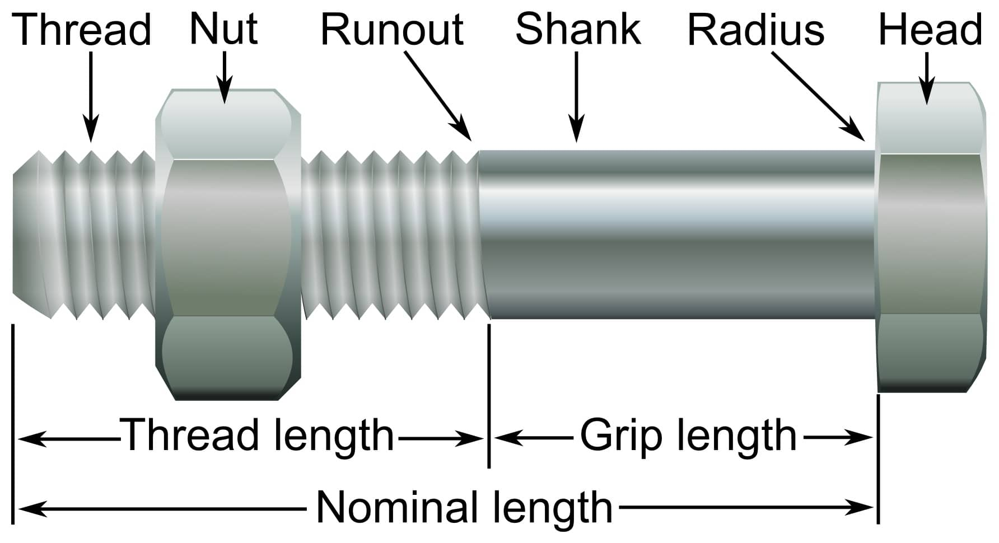
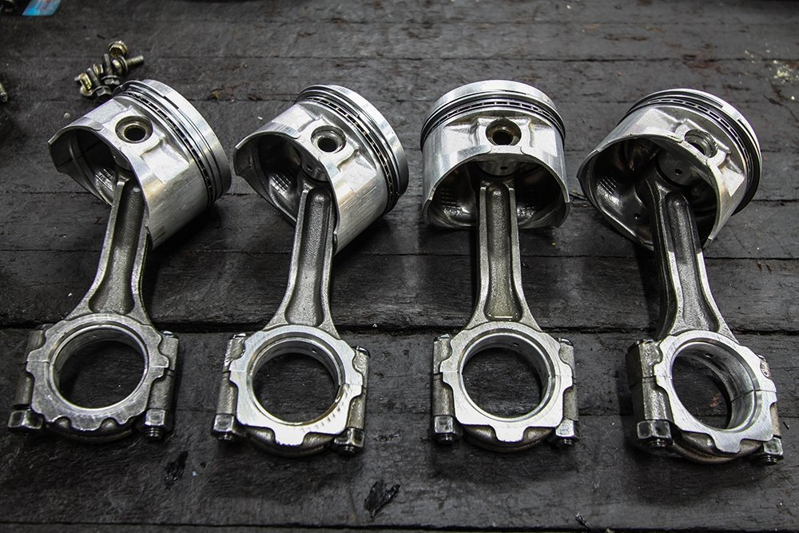
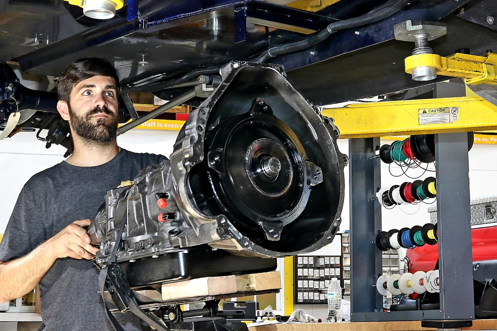
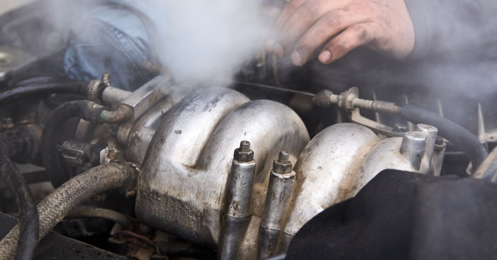

```{r setup, include=FALSE}
knitr::opts_chunk$set(echo = TRUE)
knitr::opts_chunk$set(warning = FALSE, message = FALSE)
library(readxl)
library(tidyverse)
library(tidymodels)
library(ISLR)
library(lubridate)
library(rpart.plot)
library(vip)
library(janitor)
library(randomForest)
library(xgboost)
library(dplyr)
library(glue)
library(ISLR2)
library(discrim)
library(poissonreg)
library(corrr)
library(klaR)
library(corrplot)
library(glmnet)
library(parsnip)
library(tune)
library(modeldata)
library(workflows)
library(ranger)
library(vip)
library(kernlab)
library(vembedr)
tidymodels_prefer()
```

# Vehicle Inspection Data

Just how useful is a vehicle inspection by a licensed mechanic? In this project we will explore a data set collected by mechanics during inspection of tranmissions.

## Background

If you are unfamiliar with transmissions feel free to give this highly informative video a whirl:

```{r}
embed_youtube("RQWejyx0gi8")
```

## About this Data Set

```{r}

codebook <- read_excel("archive/data (3) (1) (2).xlsx")
data <- read_excel("archive/data (3) (1) (2).xlsx", 2)

data <- as_tibble(data) %>% 
  clean_names()

```

This data set includes the appointment ID of the inspection along with a multitude of information collected by the mechanics. To begin with the registration date of the vehicle is included. Continuing we have information regarding the health of the battery, the level of the oil according to the dipstick, the quality of the oil present, the repair of the transmission itself, the coolant levels, the transmission's mounting, any sound or smoke exuding, the operation of the gearshift, and finally any additional comments.

The way that this information is stored on the csv is very interesting. Each general category is included as a yes/no character datatype. Then additional information is included as comments by the mechanic. This additional information has little to no organization. Because of this I spent a large amount of my time cleaning the data.

## Data Cleaning

```{r}

# test_data <- data %>% 
#    mutate(inspectionDate = as.Date(inspectionStartTime)) %>% 
#    select(inspectionDate, everything(), -inspectionStartTime)

test_data <- data %>%
  mutate(appointment_num = row_number()) %>%
  select(appointment_num, everything(), -appointment_id)

test_data <- test_data %>%
  mutate(registration_date = as.Date(paste(year, month, "01", sep = "-"))) %>%
  select(appointment_num, inspection_start_time, registration_date, everything(), -year, -month)

test_data <- test_data %>% 
  mutate(engine_transmission_battery_value = as.factor(engine_transmission_battery_value))

levels(test_data$engine_transmission_battery_value)

test_data <- test_data %>%
  mutate(engine_transmission_battery_cc_value_0 = as.factor(engine_transmission_battery_cc_value_0))

levels(test_data$engine_transmission_battery_cc_value_0)

test_data <- test_data %>%
  mutate(engine_transmission_battery_cc_value_1 = as.factor(engine_transmission_battery_cc_value_1))

#levels(test_data$engine_transmission_battery_cc_value_1)

test_data <- test_data %>%
  mutate(engine_transmission_battery_cc_value_2 = as.factor(engine_transmission_battery_cc_value_2))

#levels(test_data$engine_transmission_battery_cc_value_2)

test_data <- test_data %>%
  mutate(engine_transmission_battery_cc_value_3 = as.factor(engine_transmission_battery_cc_value_3))

#levels(test_data$engine_transmission_battery_cc_value_3)

test_data <- test_data %>%
  mutate(engine_transmission_battery_cc_value_4 = as.factor(engine_transmission_battery_cc_value_4))

#levels(test_data$engine_transmission_battery_cc_value_4)

test_data <- test_data %>% 
  select(everything(), -engine_transmission_battery_cc_value_4)

# test_data %>%
#   filter(engine_transmission_battery_cc_value_0 == "Discharging light glowing")
# 
# test_data %>%
#   filter(engine_transmission_battery_cc_value_1 == "Discharging light glowing")
# 
# test_data %>%
#   filter(engine_transmission_battery_cc_value_2 == "Discharging light glowing")
# 
# test_data %>%
#   filter(engine_transmission_battery_cc_value_3 == "Discharging light glowing")
# 
# test_data %>% 
#   filter(engine_transmission_battery_value == "No")

```

I will begin with the engine transmission battery block. This value tells us if the battery is in good working condition or not. Each one of the following 4 variables (engine_transmission_battery_cc_value_0, engine_transmission_battery_cc_value_1, engine_transmission_battery_cc_value_2, engine_transmission_battery_cc_value_3, and engine_transmission_battery_cc_value_4) are each entries in a computer system that further describe the working condition of the battery. For example engine_transmission_battery_cc_value_0 tells us if the battery needs to be changed, if the discharging light is glowing, if it needs a jump start, if it's not working, or if it's weak. The additional variables contain more information.


As mentioned the mechanic fills in the first input and if he has some additional information he will continue to the second input, so on so forth. However, the same mechanic is not working everyday. Due to this confoundation, the information is not organized optimally. So I will instead create 5 yes/no factors "Changed", "Discharging light glowing", "Jump Start", "Not Working",and "Weak". Furthermore, the engine_transmission_battery_value yes/no factor is extraneous so it will be removed.

Initially, I thought that this would be unique to this portion of the data cleaning so my method was not as efficient as it could have been. I started with the battery changed tag. I created 4 variables to identify if the mechanic wrote down "change" for each of the input values related to the battery. It would have been 5 but the final entry "engine_transmission_battery_cc_value_4" was actually a completely empty set.



Then I merged each of the 5 identifiers into a single column. I named this column "changed_engine_transmission_battery". I did the exact same thing for each of the other identifiers. After all of that, and confirming that the rows did add up to the expected value, I removed the now unnecessary and previously disorganized data columns.

```{r}

test_data <- test_data %>% 
  mutate(changed1 = if_else(engine_transmission_battery_cc_value_0 == "Changed", 1, 0, 0)) %>%
  select(changed1, everything())

test_data <- test_data %>% 
  mutate(changed2 = if_else(engine_transmission_battery_cc_value_1 == "Changed", 1, 0, 0)) %>%
  select(changed1, changed2, everything())

test_data <- test_data %>% 
  mutate(changed3 = if_else(engine_transmission_battery_cc_value_2 == "Changed", 1, 0, 0)) %>%
  select(changed1, changed2, changed3, everything())

test_data <- test_data %>% 
  mutate(changed4 = if_else(engine_transmission_battery_cc_value_3 == "Changed", 1, 0, 0)) %>%
  select(changed1, changed2, changed3, changed4, everything())

test_data <- test_data %>% 
  mutate(changed_engine_transmission_battery = changed1 + changed2 + changed3 + changed4) %>% 
  mutate(changed_engine_transmission_battery = as.factor(changed_engine_transmission_battery)) %>% 
  select(appointment_num:registration_date, changed_engine_transmission_battery, everything(), -changed1, -changed2, -changed3, -changed4, -engine_transmission_battery_value)

#levels(test_data$changed_engine_transmission_battery)

```


```{r}

test_data <- test_data %>% 
  mutate(changed1 = if_else(engine_transmission_battery_cc_value_0 == "Discharging light glowing", 1, 0, 0)) %>%
  select(changed1, everything())

test_data <- test_data %>% 
  mutate(changed2 = if_else(engine_transmission_battery_cc_value_1 == "Discharging light glowing", 1, 0, 0)) %>%
  select(changed1, changed2, everything())

test_data <- test_data %>% 
  mutate(changed3 = if_else(engine_transmission_battery_cc_value_2 == "Discharging light glowing", 1, 0, 0)) %>%
  select(changed1, changed2, changed3, everything())

test_data <- test_data %>% 
  mutate(changed4 = if_else(engine_transmission_battery_cc_value_3 == "Discharging light glowing", 1, 0, 0)) %>%
  select(changed1, changed2, changed3, changed4, everything())

test_data <- test_data %>% 
  mutate(discharging_light_glowing_engine_transmission_battery = changed1 + changed2 + changed3 + changed4) %>% 
  mutate(discharging_light_glowing_engine_transmission_battery = as.factor(discharging_light_glowing_engine_transmission_battery)) %>% 
  select(appointment_num:registration_date, discharging_light_glowing_engine_transmission_battery, everything(), -changed1, -changed2, -changed3, -changed4)

#levels(test_data$discharging_light_glowing_engine_transmission_battery)

```


```{r}

test_data <- test_data %>% 
  mutate(changed1 = if_else(engine_transmission_battery_cc_value_0 == "Jump Start", 1, 0, 0)) %>%
  select(changed1, everything())

test_data <- test_data %>% 
  mutate(changed2 = if_else(engine_transmission_battery_cc_value_1 == "Jump Start", 1, 0, 0)) %>%
  select(changed1, changed2, everything())

test_data <- test_data %>% 
  mutate(changed3 = if_else(engine_transmission_battery_cc_value_2 == "Jump Start", 1, 0, 0)) %>%
  select(changed1, changed2, changed3, everything())

test_data <- test_data %>% 
  mutate(changed4 = if_else(engine_transmission_battery_cc_value_3 == "Jump Start", 1, 0, 0)) %>%
  select(changed1, changed2, changed3, changed4, everything())

test_data <- test_data %>% 
  mutate(jump_start_engine_transmission_battery = changed1 + changed2 + changed3 + changed4) %>% 
  mutate(jump_start_engine_transmission_battery = as.factor(jump_start_engine_transmission_battery)) %>% 
  select(appointment_num:registration_date, jump_start_engine_transmission_battery, everything(), -changed1, -changed2, -changed3, -changed4)

#levels(test_data$jump_start_engine_transmission_battery)

```


```{r}

test_data <- test_data %>% 
  mutate(changed1 = if_else(engine_transmission_battery_cc_value_0 == "Not Working", 1, 0, 0)) %>%
  select(changed1, everything())

test_data <- test_data %>% 
  mutate(changed2 = if_else(engine_transmission_battery_cc_value_1 == "Not Working", 1, 0, 0)) %>%
  select(changed1, changed2, everything())

test_data <- test_data %>% 
  mutate(changed3 = if_else(engine_transmission_battery_cc_value_2 == "Not Working", 1, 0, 0)) %>%
  select(changed1, changed2, changed3, everything())

test_data <- test_data %>% 
  mutate(changed4 = if_else(engine_transmission_battery_cc_value_3 == "Not Working", 1, 0, 0)) %>%
  select(changed1, changed2, changed3, changed4, everything())

test_data <- test_data %>% 
  mutate(not_working_engine_transmission_battery = changed1 + changed2 + changed3 + changed4) %>% 
  mutate(not_working_engine_transmission_battery = as.factor(not_working_engine_transmission_battery)) %>% 
  select(appointment_num:registration_date, not_working_engine_transmission_battery, everything(), -changed1, -changed2, -changed3, -changed4)

#levels(test_data$not_working_engine_transmission_battery)

```


```{r}

test_data <- test_data %>% 
  mutate(changed1 = if_else(engine_transmission_battery_cc_value_0 == "Weak", 1, 0, 0)) %>%
  select(changed1, everything())

test_data <- test_data %>% 
  mutate(changed2 = if_else(engine_transmission_battery_cc_value_1 == "Weak", 1, 0, 0)) %>%
  select(changed1, changed2, everything())

test_data <- test_data %>% 
  mutate(changed3 = if_else(engine_transmission_battery_cc_value_2 == "Weak", 1, 0, 0)) %>%
  select(changed1, changed2, changed3, everything())

test_data <- test_data %>% 
  mutate(changed4 = if_else(engine_transmission_battery_cc_value_3 == "Weak", 1, 0, 0)) %>%
  select(changed1, changed2, changed3, changed4, everything())

test_data <- test_data %>% 
  mutate(weak_engine_transmission_battery = changed1 + changed2 + changed3 + changed4) %>% 
  mutate(weak_engine_transmission_battery = as.factor(weak_engine_transmission_battery)) %>% 
  select(appointment_num:registration_date, weak_engine_transmission_battery, everything(), -changed1, -changed2, -changed3, -changed4, -engine_transmission_battery_cc_value_0, -engine_transmission_battery_cc_value_1, -engine_transmission_battery_cc_value_2, -engine_transmission_battery_cc_value_3)

#levels(test_data$weak_engine_transmission_battery)

```


```{r}
#levels(as.factor(test_data$engine_transmission_engine_oil_level_dipstick_cc_value_0))

test_data <- test_data %>% 
  mutate(broken_engine_transmission_engine_oil_level_dipstick = if_else(engine_transmission_engine_oil_level_dipstick_cc_value_0 == "Broken", 1, 0, 0)) %>%
  mutate(broken_engine_transmission_engine_oil_level_dipstick = as.factor(broken_engine_transmission_engine_oil_level_dipstick)) %>% 
  select(appointment_num:changed_engine_transmission_battery, broken_engine_transmission_engine_oil_level_dipstick, everything(), -engine_transmission_engineoil_level_dipstick_value, -engine_transmission_engine_oil_level_dipstick_cc_value_0)

#levels(test_data$broken_engine_transmission_engine_oil_level_dipstick)
```

After all those lines of code, I know what you're thinking. Why didn't I use step_dummy to simplify and automate this process. Well that would be too easy. For some reason it wouldn't work.

Continuing with my long and arduous process, I decided to use the same exact method on the transmission engine oil set of data. However, this time there were even more options input by the mechanics. They managed to fit 9 different possible values into 11 different columns and didn't worry about putting the common values into a single column. So I did it for them. Did I automate the process? No, I was still in the baby steps of my mechanics (pun intended). We'll get to automation later.

Here: are the possible values that the mechanics assigned to the tranmission engine oil:

```{r}

levels(as.factor(test_data$engine_transmission_engine_oil_cc_value_0))
# levels(as.factor(test_data$engine_transmission_engine_oil_cc_value_1))
# levels(as.factor(test_data$engine_transmission_engine_oil_cc_value_2))
# levels(as.factor(test_data$engine_transmission_engine_oil_cc_value_3))
# levels(as.factor(test_data$engine_transmission_engine_oil_cc_value_4))
# levels(as.factor(test_data$engine_transmission_engine_oil_cc_value_5))
# levels(as.factor(test_data$engine_transmission_engine_oil_cc_value_6))
# levels(as.factor(test_data$engine_transmission_engine_oil_cc_value_7))
# levels(as.factor(test_data$engine_transmission_engine_oil_cc_value_8))
# levels(as.factor(test_data$engine_transmission_engine_oil_cc_value_9))
```

```{r}

test_data <- test_data %>% 
  mutate(changed1 = if_else(engine_transmission_engine_oil_cc_value_0 == "Dirty", 1, 0, 0)) %>%
  select(changed1, everything())

test_data <- test_data %>% 
  mutate(changed2 = if_else(engine_transmission_engine_oil_cc_value_1 == "Dirty", 1, 0, 0)) %>%
  select(changed1, changed2, everything())

test_data <- test_data %>% 
  mutate(changed3 = if_else(engine_transmission_engine_oil_cc_value_2 == "Dirty", 1, 0, 0)) %>%
  select(changed1, changed2, changed3, everything())

test_data <- test_data %>% 
  mutate(changed4 = if_else(engine_transmission_engine_oil_cc_value_3 == "Dirty", 1, 0, 0)) %>%
  select(changed1, changed2, changed3, changed4, everything())

test_data <- test_data %>% 
  mutate(changed5 = if_else(engine_transmission_engine_oil_cc_value_4 == "Dirty", 1, 0, 0)) %>%
  select(changed1, changed2, changed3, changed4, everything())

test_data <- test_data %>% 
  mutate(changed6 = if_else(engine_transmission_engine_oil_cc_value_5 == "Dirty", 1, 0, 0)) %>%
  select(changed1, changed2, changed3, changed4, everything())

test_data <- test_data %>% 
  mutate(changed7 = if_else(engine_transmission_engine_oil_cc_value_6 == "Dirty", 1, 0, 0)) %>%
  select(changed1, changed2, changed3, changed4, everything())

test_data <- test_data %>% 
  mutate(dirty_engine_transmission_engine_oil = changed1 + changed2 + changed3 + changed4 + changed5 + changed6 + changed7) %>% 
  mutate(dirty_engine_transmission_engine_oil = as.factor(dirty_engine_transmission_engine_oil)) %>% 
  select(appointment_num:broken_engine_transmission_engine_oil_level_dipstick, dirty_engine_transmission_engine_oil, everything(), -changed1, -changed2, -changed3, -changed4, -changed5, -changed6, -changed7)

#levels(test_data$dirty_engine_transmission_engine_oil)

```


```{r}

test_data <- test_data %>% 
  mutate(changed1 = if_else(engine_transmission_engine_oil_cc_value_0 == "Leakage from Side cover", 1, 0, 0)) %>%
  select(changed1, everything())

test_data <- test_data %>% 
  mutate(changed2 = if_else(engine_transmission_engine_oil_cc_value_1 == "Leakage from Side cover", 1, 0, 0)) %>%
  select(changed1, changed2, everything())

test_data <- test_data %>% 
  mutate(changed3 = if_else(engine_transmission_engine_oil_cc_value_2 == "Leakage from Side cover", 1, 0, 0)) %>%
  select(changed1, changed2, changed3, everything())

test_data <- test_data %>% 
  mutate(changed4 = if_else(engine_transmission_engine_oil_cc_value_3 == "Leakage from Side cover", 1, 0, 0)) %>%
  select(changed1, changed2, changed3, changed4, everything())

test_data <- test_data %>% 
  mutate(changed5 = if_else(engine_transmission_engine_oil_cc_value_4 == "Leakage from Side cover", 1, 0, 0)) %>%
  select(changed1, changed2, changed3, changed4, everything())

test_data <- test_data %>% 
  mutate(changed6 = if_else(engine_transmission_engine_oil_cc_value_5 == "Leakage from Side cover", 1, 0, 0)) %>%
  select(changed1, changed2, changed3, changed4, everything())

test_data <- test_data %>% 
  mutate(changed7 = if_else(engine_transmission_engine_oil_cc_value_6 == "Leakage from Side cover", 1, 0, 0)) %>%
  select(changed1, changed2, changed3, changed4, everything())

test_data <- test_data %>% 
  mutate(leakage_from_side_engine_transmission_engine_oil = changed1 + changed2 + changed3 + changed4 + changed5 + changed6 + changed7) %>% 
  mutate(leakage_from_side_engine_transmission_engine_oil = as.factor(leakage_from_side_engine_transmission_engine_oil)) %>% 
  select(appointment_num:broken_engine_transmission_engine_oil_level_dipstick, leakage_from_side_engine_transmission_engine_oil, everything(), -changed1, -changed2, -changed3, -changed4, -changed5, -changed6, -changed7)

#levels(test_data$leakage_from_side_engine_transmission_engine_oil)

```


```{r}

test_data <- test_data %>% 
  mutate(changed1 = if_else(engine_transmission_engine_oil_cc_value_0 == "Leakage from Sump/chamber", 1, 0, 0)) %>%
  select(changed1, everything())

test_data <- test_data %>% 
  mutate(changed2 = if_else(engine_transmission_engine_oil_cc_value_1 == "Leakage from Sump/chamber", 1, 0, 0)) %>%
  select(changed1, changed2, everything())

test_data <- test_data %>% 
  mutate(changed3 = if_else(engine_transmission_engine_oil_cc_value_2 == "Leakage from Sump/chamber", 1, 0, 0)) %>%
  select(changed1, changed2, changed3, everything())

test_data <- test_data %>% 
  mutate(changed4 = if_else(engine_transmission_engine_oil_cc_value_3 == "Leakage from Sump/chamber", 1, 0, 0)) %>%
  select(changed1, changed2, changed3, changed4, everything())

test_data <- test_data %>% 
  mutate(changed5 = if_else(engine_transmission_engine_oil_cc_value_4 == "Leakage from Sump/chamber", 1, 0, 0)) %>%
  select(changed1, changed2, changed3, changed4, everything())

test_data <- test_data %>% 
  mutate(changed6 = if_else(engine_transmission_engine_oil_cc_value_5 == "Leakage from Sump/chamber", 1, 0, 0)) %>%
  select(changed1, changed2, changed3, changed4, everything())

test_data <- test_data %>% 
  mutate(changed7 = if_else(engine_transmission_engine_oil_cc_value_6 == "Leakage from Sump/chamber", 1, 0, 0)) %>%
  select(changed1, changed2, changed3, changed4, everything())

test_data <- test_data %>% 
  mutate(leakage_from_sump_chamber_engine_transmission_engine_oil = changed1 + changed2 + changed3 + changed4 + changed5 + changed6 + changed7) %>% 
  mutate(leakage_from_sump_chamber_engine_transmission_engine_oil = as.factor(leakage_from_sump_chamber_engine_transmission_engine_oil)) %>% 
  select(appointment_num:broken_engine_transmission_engine_oil_level_dipstick, leakage_from_sump_chamber_engine_transmission_engine_oil, everything(), -changed1, -changed2, -changed3, -changed4, -changed5, -changed6, -changed7)

#levels(test_data$leakage_from_sump_chamber_engine_transmission_engine_oil)

```

```{r}

test_data <- test_data %>% 
  mutate(changed1 = if_else(engine_transmission_engine_oil_cc_value_0 == "Leakage from Tappet Cover", 1, 0, 0)) %>%
  select(changed1, everything())

test_data <- test_data %>% 
  mutate(changed2 = if_else(engine_transmission_engine_oil_cc_value_1 == "Leakage from Tappet Cover", 1, 0, 0)) %>%
  select(changed1, changed2, everything())

test_data <- test_data %>% 
  mutate(changed3 = if_else(engine_transmission_engine_oil_cc_value_2 == "Leakage from Tappet Cover", 1, 0, 0)) %>%
  select(changed1, changed2, changed3, everything())

test_data <- test_data %>% 
  mutate(changed4 = if_else(engine_transmission_engine_oil_cc_value_3 == "Leakage from Tappet Cover", 1, 0, 0)) %>%
  select(changed1, changed2, changed3, changed4, everything())

test_data <- test_data %>% 
  mutate(changed5 = if_else(engine_transmission_engine_oil_cc_value_4 == "Leakage from Tappet Cover", 1, 0, 0)) %>%
  select(changed1, changed2, changed3, changed4, everything())

test_data <- test_data %>% 
  mutate(changed6 = if_else(engine_transmission_engine_oil_cc_value_5 == "Leakage from Tappet Cover", 1, 0, 0)) %>%
  select(changed1, changed2, changed3, changed4, everything())

test_data <- test_data %>% 
  mutate(changed7 = if_else(engine_transmission_engine_oil_cc_value_6 == "Leakage from Tappet Cover", 1, 0, 0)) %>%
  select(changed1, changed2, changed3, changed4, everything())

test_data <- test_data %>% 
  mutate(leakage_from_tappet_cover_engine_transmission_engine_oil = changed1 + changed2 + changed3 + changed4 + changed5 + changed6 + changed7) %>% 
  mutate(leakage_from_tappet_cover_engine_transmission_engine_oil = as.factor(leakage_from_tappet_cover_engine_transmission_engine_oil)) %>% 
  select(appointment_num:broken_engine_transmission_engine_oil_level_dipstick, leakage_from_tappet_cover_engine_transmission_engine_oil, everything(), -changed1, -changed2, -changed3, -changed4, -changed5, -changed6, -changed7)

#levels(test_data$leakage_from_tappet_cover_engine_transmission_engine_oil)

```

```{r}

test_data <- test_data %>% 
  mutate(changed1 = if_else(engine_transmission_engine_oil_cc_value_0 == "Leaking", 1, 0, 0)) %>%
  select(changed1, everything())

test_data <- test_data %>% 
  mutate(changed2 = if_else(engine_transmission_engine_oil_cc_value_1 == "Leaking", 1, 0, 0)) %>%
  select(changed1, changed2, everything())

test_data <- test_data %>% 
  mutate(changed3 = if_else(engine_transmission_engine_oil_cc_value_2 == "Leaking", 1, 0, 0)) %>%
  select(changed1, changed2, changed3, everything())

test_data <- test_data %>% 
  mutate(changed4 = if_else(engine_transmission_engine_oil_cc_value_3 == "Leaking", 1, 0, 0)) %>%
  select(changed1, changed2, changed3, changed4, everything())

test_data <- test_data %>% 
  mutate(changed5 = if_else(engine_transmission_engine_oil_cc_value_4 == "Leaking", 1, 0, 0)) %>%
  select(changed1, changed2, changed3, changed4, everything())

test_data <- test_data %>% 
  mutate(changed6 = if_else(engine_transmission_engine_oil_cc_value_5 == "Leaking", 1, 0, 0)) %>%
  select(changed1, changed2, changed3, changed4, everything())

test_data <- test_data %>% 
  mutate(changed7 = if_else(engine_transmission_engine_oil_cc_value_6 == "Leaking", 1, 0, 0)) %>%
  select(changed1, changed2, changed3, changed4, everything())

test_data <- test_data %>% 
  mutate(leaking_engine_transmission_engine_oil = changed1 + changed2 + changed3 + changed4 + changed5 + changed6 + changed7) %>% 
  mutate(leaking_engine_transmission_engine_oil = as.factor(leaking_engine_transmission_engine_oil)) %>% 
  select(appointment_num:broken_engine_transmission_engine_oil_level_dipstick, leaking_engine_transmission_engine_oil, everything(), -changed1, -changed2, -changed3, -changed4, -changed5, -changed6, -changed7)

#levels(test_data$leaking_engine_transmission_engine_oil)

```


```{r}

test_data <- test_data %>% 
  mutate(changed1 = if_else(engine_transmission_engine_oil_cc_value_0 == "Leakage from Turbo Charger", 1, 0, 0)) %>%
  select(changed1, everything())

test_data <- test_data %>% 
  mutate(changed2 = if_else(engine_transmission_engine_oil_cc_value_1 == "Leakage from Turbo Charger", 1, 0, 0)) %>%
  select(changed1, changed2, everything())

test_data <- test_data %>% 
  mutate(changed3 = if_else(engine_transmission_engine_oil_cc_value_2 == "Leakage from Turbo Charger", 1, 0, 0)) %>%
  select(changed1, changed2, changed3, everything())

test_data <- test_data %>% 
  mutate(changed4 = if_else(engine_transmission_engine_oil_cc_value_3 == "Leakage from Turbo Charger", 1, 0, 0)) %>%
  select(changed1, changed2, changed3, changed4, everything())

test_data <- test_data %>% 
  mutate(changed5 = if_else(engine_transmission_engine_oil_cc_value_4 == "Leakage from Turbo Charger", 1, 0, 0)) %>%
  select(changed1, changed2, changed3, changed4, everything())

test_data <- test_data %>% 
  mutate(changed6 = if_else(engine_transmission_engine_oil_cc_value_5 == "Leakage from Turbo Charger", 1, 0, 0)) %>%
  select(changed1, changed2, changed3, changed4, everything())

test_data <- test_data %>% 
  mutate(changed7 = if_else(engine_transmission_engine_oil_cc_value_6 == "Leakage from Turbo Charger", 1, 0, 0)) %>%
  select(changed1, changed2, changed3, changed4, everything())

test_data <- test_data %>% 
  mutate(leakage_from_turbo_charger_engine_transmission_engine_oil = changed1 + changed2 + changed3 + changed4 + changed5 + changed6 + changed7) %>% 
  mutate(leakage_from_turbo_charger_engine_transmission_engine_oil = as.factor(leakage_from_turbo_charger_engine_transmission_engine_oil)) %>% 
  select(appointment_num:broken_engine_transmission_engine_oil_level_dipstick, leakage_from_turbo_charger_engine_transmission_engine_oil, everything(), -changed1, -changed2, -changed3, -changed4, -changed5, -changed6, -changed7)

#levels(test_data$leakage_from_turbo_charger_engine_transmission_engine_oil)

```


```{r}

test_data <- test_data %>% 
  mutate(changed1 = if_else(engine_transmission_engine_oil_cc_value_0 == "Mixed with Coolant", 1, 0, 0)) %>%
  select(changed1, everything())

test_data <- test_data %>% 
  mutate(changed2 = if_else(engine_transmission_engine_oil_cc_value_1 == "Mixed with Coolant", 1, 0, 0)) %>%
  select(changed1, changed2, everything())

test_data <- test_data %>% 
  mutate(changed3 = if_else(engine_transmission_engine_oil_cc_value_2 == "Mixed with Coolant", 1, 0, 0)) %>%
  select(changed1, changed2, changed3, everything())

test_data <- test_data %>% 
  mutate(changed4 = if_else(engine_transmission_engine_oil_cc_value_3 == "Mixed with Coolant", 1, 0, 0)) %>%
  select(changed1, changed2, changed3, changed4, everything())

test_data <- test_data %>% 
  mutate(changed5 = if_else(engine_transmission_engine_oil_cc_value_4 == "Mixed with Coolant", 1, 0, 0)) %>%
  select(changed1, changed2, changed3, changed4, everything())

test_data <- test_data %>% 
  mutate(changed6 = if_else(engine_transmission_engine_oil_cc_value_5 == "Mixed with Coolant", 1, 0, 0)) %>%
  select(changed1, changed2, changed3, changed4, everything())

test_data <- test_data %>% 
  mutate(changed7 = if_else(engine_transmission_engine_oil_cc_value_6 == "Mixed with Coolant", 1, 0, 0)) %>%
  select(changed1, changed2, changed3, changed4, everything())

test_data <- test_data %>% 
  mutate(mixed_with_coolant_engine_transmission_engine_oil = changed1 + changed2 + changed3 + changed4 + changed5 + changed6 + changed7) %>% 
  mutate(mixed_with_coolant_engine_transmission_engine_oil = as.factor(mixed_with_coolant_engine_transmission_engine_oil)) %>% 
  select(appointment_num:broken_engine_transmission_engine_oil_level_dipstick, mixed_with_coolant_engine_transmission_engine_oil, everything(), -changed1, -changed2, -changed3, -changed4, -changed5, -changed6, -changed7)

#levels(test_data$mixed_with_coolant_engine_transmission_engine_oil)

```


```{r}

test_data <- test_data %>% 
  mutate(changed1 = if_else(engine_transmission_engine_oil_cc_value_0 == "Low Pressure warning light glowing", 1, 0, 0)) %>%
  select(changed1, everything())

test_data <- test_data %>% 
  mutate(changed2 = if_else(engine_transmission_engine_oil_cc_value_1 == "Low Pressure warning light glowing", 1, 0, 0)) %>%
  select(changed1, changed2, everything())

test_data <- test_data %>% 
  mutate(changed3 = if_else(engine_transmission_engine_oil_cc_value_2 == "Low Pressure warning light glowing", 1, 0, 0)) %>%
  select(changed1, changed2, changed3, everything())

test_data <- test_data %>% 
  mutate(changed4 = if_else(engine_transmission_engine_oil_cc_value_3 == "Low Pressure warning light glowing", 1, 0, 0)) %>%
  select(changed1, changed2, changed3, changed4, everything())

test_data <- test_data %>% 
  mutate(changed5 = if_else(engine_transmission_engine_oil_cc_value_4 == "Low Pressure warning light glowing", 1, 0, 0)) %>%
  select(changed1, changed2, changed3, changed4, everything())

test_data <- test_data %>% 
  mutate(changed6 = if_else(engine_transmission_engine_oil_cc_value_5 == "Low Pressure warning light glowing", 1, 0, 0)) %>%
  select(changed1, changed2, changed3, changed4, everything())

test_data <- test_data %>% 
  mutate(changed7 = if_else(engine_transmission_engine_oil_cc_value_6 == "Low Pressure warning light glowing", 1, 0, 0)) %>%
  select(changed1, changed2, changed3, changed4, everything())

test_data <- test_data %>% 
  mutate(low_pressure_warning_light_glowing_engine_transmission_engine_oil = changed1 + changed2 + changed3 + changed4 + changed5 + changed6 + changed7) %>% 
  mutate(low_pressure_warning_light_glowing_engine_transmission_engine_oil = as.factor(low_pressure_warning_light_glowing_engine_transmission_engine_oil)) %>% 
  select(appointment_num:broken_engine_transmission_engine_oil_level_dipstick, low_pressure_warning_light_glowing_engine_transmission_engine_oil, everything(), -changed1, -changed2, -changed3, -changed4, -changed5, -changed6, -changed7)

#levels(test_data$low_pressure_warning_light_glowing_engine_transmission_engine_oil)

```


```{r}

test_data <- test_data %>% 
  mutate(changed1 = if_else(engine_transmission_engine_oil_cc_value_0 == "Level Low", 1, 0, 0)) %>%
  select(changed1, everything())

test_data <- test_data %>% 
  mutate(changed2 = if_else(engine_transmission_engine_oil_cc_value_1 == "Level Low", 1, 0, 0)) %>%
  select(changed1, changed2, everything())

test_data <- test_data %>% 
  mutate(changed3 = if_else(engine_transmission_engine_oil_cc_value_2 == "Level Low", 1, 0, 0)) %>%
  select(changed1, changed2, changed3, everything())

test_data <- test_data %>% 
  mutate(changed4 = if_else(engine_transmission_engine_oil_cc_value_3 == "Level Low", 1, 0, 0)) %>%
  select(changed1, changed2, changed3, changed4, everything())

test_data <- test_data %>% 
  mutate(changed5 = if_else(engine_transmission_engine_oil_cc_value_4 == "Level Low", 1, 0, 0)) %>%
  select(changed1, changed2, changed3, changed4, everything())

test_data <- test_data %>% 
  mutate(changed6 = if_else(engine_transmission_engine_oil_cc_value_5 == "Level Low", 1, 0, 0)) %>%
  select(changed1, changed2, changed3, changed4, everything())

test_data <- test_data %>% 
  mutate(changed7 = if_else(engine_transmission_engine_oil_cc_value_6 == "Level Low", 1, 0, 0)) %>%
  select(changed1, changed2, changed3, changed4, everything())

test_data <- test_data %>% 
  mutate(level_low_engine_transmission_engine_oil = changed1 + changed2 + changed3 + changed4 + changed5 + changed6 + changed7) %>% 
  mutate(level_low_engine_transmission_engine_oil = as.factor(level_low_engine_transmission_engine_oil)) %>% 
  select(appointment_num:broken_engine_transmission_engine_oil_level_dipstick, level_low_engine_transmission_engine_oil, everything(), -changed1, -changed2, -changed3, -changed4, -changed5, -changed6, -changed7)

test_data <- test_data %>% 
  select(everything(), -engine_transmission_engine_oil, -engine_transmission_engine_oil_cc_value_0, -engine_transmission_engine_oil_cc_value_1, -engine_transmission_engine_oil_cc_value_2, -engine_transmission_engine_oil_cc_value_3, -engine_transmission_engine_oil_cc_value_4, -engine_transmission_engine_oil_cc_value_5, -engine_transmission_engine_oil_cc_value_6, -engine_transmission_engine_oil_cc_value_7, -engine_transmission_engine_oil_cc_value_8, -engine_transmission_engine_oil_cc_value_9)

#levels(test_data$level_low_engine_transmission_engine_oil)

```

The gears were beginning to turn in my mind. I had another 50 columns to go through. I was almost at 700 lines of code! I knew that I couldn't go on like this any more.

I decided to attempt to automate my process. My first few attempts to write a function that could dynamically create variables, assign values to them, manipulate those newly created variables, combine them into a new dynamically named variable, and delete all of the columns that were no longer needed were rocky to say the least.



However, after many hours of research and testing I was finally able to create a function that automated like... at least half of my work. Don't worry I still wrote 1500+ lines of code.

Here are the variables that the mechanics used to describe the transmission itself.


```{r}

levels(as.factor(test_data$engine_transmission_engine_cc_value_0))
# levels(as.factor(test_data$engine_transmission_engine_cc_value_1))
# levels(as.factor(test_data$engine_transmission_engine_cc_value_2))
# levels(as.factor(test_data$engine_transmission_engine_cc_value_3))
# levels(as.factor(test_data$engine_transmission_engine_cc_value_4))
# levels(as.factor(test_data$engine_transmission_engine_cc_value_5))
# levels(as.factor(test_data$engine_transmission_engine_cc_value_6))
# levels(as.factor(test_data$engine_transmission_engine_cc_value_7))
# levels(as.factor(test_data$engine_transmission_engine_cc_value_8))
# levels(as.factor(test_data$engine_transmission_engine_cc_value_9))
```


```{r}
# test_data$paste("var","name", sep = "_")
# for (n in length(levels)){
# for (m in length(variables)){
# test_data <- test_data %>% 
#   mutate(var_name = if_else(variables[m] == levels[n], 1, 0, 0)) %>% 
#   select(var_name, everything())
# }}
# 
# 
# minimizer <- function(levels, variables) {
#   
# for (n in length(levels)){
# for (m in length(variables)){
#   var_name = paste("changed", m, sep = "")
# test_data <- test_data %>% 
#   mutate(var_name = if_else(variables[m] == levels[n], 1, 0, 0))
# 
# new_variable_name = paste(levels[n], variables[m], sep = "_")
# 
# print(new_variable_name)
# test_data <- test_data %>% 
#   mutate(new_variable_name = 0)
# 
# test_data <- test_data %>% 
#   mutate(new_variable_name = new_variable_name + var_name) %>% 
#   select(everything())
# 
# }}
# }
# 
# levels <- c("Car not working on Petrol", "Fuel Leakage From Injector", "MIL light glowing", "Misfiring", "Not converting to CNG", "Over heating", "Repaired", "RPM fluctuating", "RPM not increasing", "Seized", "Sump Damaged", "Turbo charger not working")
# 

# 
# minimizer(levels,variables)
# 
# for (n in length(levels)){
#   print(paste(levels[n], variables[n]))
# }
# 
# select(appointment_num:broken_engine_transmission_engine_oil_level_dipstick, new_variable_name, everything(), -changed1, -changed2, -changed3, -changed4, -changed5, -changed6, -changed7)
# mutate(new_variable_name = as.factor(new_variable_name)) %>% 
# 
# levels(test_data$new_variable_name)

```

```{r}
# for (i in 1:5) {
#   assign(paste("t",files[i],sep=""), read.tucson(files[i],header=NULL))
# }
# 
# assign(paste("t",1, sep = ""), as.list(data$appointment_id))
# 
# for(i in test_data)){
#   name <- paste("t", i, sep = "_")
#   assign(name,  transpose(df_before_transpose[[i]]))
# }
# 
# m = 1
# paste("what", 1, sep = "") = c(1,2)
# shazbot <- data.frame(assign(paste("orca", m, sep = ""), data$appointment_id), assign(paste("orca", m, sep = ""), data$inspection_start_time))
# 
# shazbot <- as.tibble(shazbot)
# 
# get(paste("orca", 1, sep = ""))
# rm(orca1)
# 
# test_data <- test_data %>% 
#    transmute(assign(paste("changed", 1, sep = "")))
# test_data %>% 
#   select(assign(paste("changed", 1, sep = ""))
  
  
# minimizer <- function(levels, variables) {
#   
# for (n in length(levels)){
# for (m in length(variables)){
#   assign(paste("changed", m, sep = ""), )
# test_data <- test_data %>% 
#   assign(paste("changed", m, sep = ""), 0)
#   mutate(var_name = if_else(variables[m] == levels[n], 1, 0, 0))
# 
# new_variable_name = paste(levels[n], variables[m], sep = "_")
# 
# print(new_variable_name)
# test_data <- test_data %>% 
#   mutate(new_variable_name = 0)
# 
# test_data <- test_data %>% 
#   mutate(new_variable_name = new_variable_name + var_name) %>% 
#   select(everything())
# 
# }}
# }

# install.packages("lazyeval")
# library(lazyeval)
# from <- "appointment_num"
# 
# 
# data %>%
#   mutate(diff=interp(~from, from=as.name(from)))
# 
# !!as.name(paste("appointment", "num", sep = "_"))
# 
# test_data %>%
#   mutate((!!as.name(paste("changed", 1, sep = ""))) = 0) %>% 
#   select((!!as.name(paste("changed", 1, sep = ""))))
# 
# minimizer <- function(levels, variables) {
# 
# for (n in length(levels)){
# for (m in length(variables)){
#   
# test_data <- test_data %>%
#   mutate(as.name(paste("changed", m, sep = "")) = if_else(variables[m] == levels[n], 1, 0, 0))
# 
# new_variable_name = paste(levels[n], variables[m], sep = "_")
# 
# print(new_variable_name)
# test_data <- test_data %>%
#   mutate(new_variable_name = 0)
# 
# test_data <- test_data %>%
#   mutate(new_variable_name = new_variable_name + var_name) %>%
#   select(everything())
# 
# }}
# }


```
```{r}
# 
# 
# 
# multipetal <- function(df, n) {
#   mutate(df, "petal.{n}" := Petal.Width * n)
# }
# 
# meanofcol <- function(df, col) {
#   mutate(df, "Mean of {{col}}" := mean({{col}}))
# }
# 
# meanofcol(iris, Petal.Width)
# 
# minimizer <- function(levels, variables) {
# 
# for (n in length(levels)){
# for (m in length(variables)){
# 
# test_data <- test_data %>%
#   mutate(as.name(paste("changed", m, sep = "")) = if_else(variables[m] == levels[n], 1, 0, 0))
# 
# new_variable_name = paste(levels[n], variables[m], sep = "_")
# 
# print(new_variable_name)
# test_data <- test_data %>%
#   mutate(new_variable_name = 0)
# 
# test_data <- test_data %>%
#   mutate(new_variable_name = new_variable_name + var_name) %>%
#   select(everything())
# 
# }}
# }

```

```{r}

multichange <- function(df, z, w) {
  x = variables[z]
  y = levels[w]
  mutate(df, "change{z}" := 1)
  mutate(df, "change{z}" := if_else(.data[[x]] == y, 1, 0, 0))
}

variables <- c("engine_transmission_engine_cc_value_0", "engine_transmission_engine_cc_value_1", "engine_transmission_engine_cc_value_2", "engine_transmission_engine_cc_value_3", "engine_transmission_engine_cc_value_4", "engine_transmission_engine_cc_value_5", "engine_transmission_engine_cc_value_6", "engine_transmission_engine_cc_value_7", "engine_transmission_engine_cc_value_8", "engine_transmission_engine_cc_value_9", "engine_transmission_engine_cc_value_10")

levels <- c("Car not working on Petrol", "Fuel Leakage From Injector", "MIL light glowing", "Misfiring", "Not converting to CNG", "Over heating", "Repaired", "RPM fluctuating", "RPM not increasing", "Seized", "Sump Damaged", "Turbo charger not working")


# n = c(1:11)
# for(i in n){
#   test_data <- multichange(test_data, i)
# }

# n = c(1:11)
# m = c(1:12)
#m = 4
for(r in c(1:length(levels))){
  for(i in c(1:length(variables))){
    test_data <- multichange(test_data, i, r)
  }
    level_name = levels[r]
    test_data <- test_data %>% 
      mutate("{level_name}_engine_transmission_engine" := change1 + change2 + change3 + change4 + change5 + change6 + change7 + change8 + change9 + change10 + change11)
}

test_data <- test_data %>% 
  clean_names()

test_data <- test_data %>%
    select(everything(), -change1, -change2, -change3, -change4, -change5, -change6, -change7, -change8, -change9, -change10, -change11, -engine_transmission_engine_cc_value_0, -engine_transmission_engine_cc_value_1, -engine_transmission_engine_cc_value_2, -engine_transmission_engine_cc_value_3, -engine_transmission_engine_cc_value_4, -engine_transmission_engine_cc_value_5, -engine_transmission_engine_cc_value_6, -engine_transmission_engine_cc_value_7, -engine_transmission_engine_cc_value_8, -engine_transmission_engine_cc_value_9, -engine_transmission_engine_cc_value_10, -engine_transmission_engine_value)

test_data <- test_data %>% 
  mutate(car_not_working_on_petrol_engine_transmission_engine = as.factor(car_not_working_on_petrol_engine_transmission_engine))

test_data <- test_data %>% 
  mutate(fuel_leakage_from_injector_engine_transmission_engine = as.factor(fuel_leakage_from_injector_engine_transmission_engine))

test_data <- test_data %>% 
  mutate(mil_light_glowing_engine_transmission_engine = as.factor(mil_light_glowing_engine_transmission_engine))

test_data <- test_data %>% 
  mutate(misfiring_engine_transmission_engine = as.factor(misfiring_engine_transmission_engine))

test_data <- test_data %>% 
  mutate(not_converting_to_cng_engine_transmission_engine = as.factor(not_converting_to_cng_engine_transmission_engine))

test_data <- test_data %>% 
  mutate(over_heating_engine_transmission_engine = as.factor(over_heating_engine_transmission_engine))

test_data <- test_data %>% 
  mutate(repaired_engine_transmission_engine = as.factor(repaired_engine_transmission_engine))

test_data <- test_data %>% 
  mutate(rpm_fluctuating_engine_transmission_engine = as.factor(rpm_fluctuating_engine_transmission_engine))

test_data <- test_data %>% 
  mutate(rpm_not_increasing_engine_transmission_engine = as.factor(rpm_not_increasing_engine_transmission_engine))

test_data <- test_data %>% 
  mutate(seized_engine_transmission_engine = as.factor(seized_engine_transmission_engine))

test_data <- test_data %>% 
  mutate(sump_damaged_engine_transmission_engine = as.factor(sump_damaged_engine_transmission_engine))

test_data <- test_data %>% 
  mutate(turbo_charger_not_working_engine_transmission_engine = as.factor(turbo_charger_not_working_engine_transmission_engine))


# minimizer <- function(levels, variables) {
# 
# for (n in length(levels)){
# for (m in length(variables)){
#   
# test_data <- test_data %>%
#   mutate(as.name(paste("changed", m, sep = "")) = if_else(variables[m] == levels[n], 1, 0, 0))
# 
# new_variable_name = paste(levels[n], variables[m], sep = "_")
# 
# print(new_variable_name)
# test_data <- test_data %>%
#   mutate(new_variable_name = 0)
# 
# test_data <- test_data %>%
#   mutate(new_variable_name = new_variable_name + var_name) %>%
#   select(everything())
# 
# }}
```

Things are getting into full swing here. As we continue, take a look at the 4 description those fabled mechanics used to describe the coolant they observed during their long, detailed, and highly flammable inspection:

```{r}

levels(as.factor(test_data$engine_transmission_coolant_cc_value_0))

variables <- c("engine_transmission_coolant_cc_value_0", "engine_transmission_coolant_cc_value_1", "engine_transmission_coolant_cc_value_2", "engine_transmission_coolant_cc_value_3")

levels <- c("Dirty", "Leaking", "Mixed with Engine Oil", "Radiator Damaged")

for(r in c(1:length(levels))){
  for(i in c(1:length(variables))){
    test_data <- multichange(test_data, i, r)
  }
    level_name = levels[r]
    test_data <- test_data %>% 
      mutate("{level_name}_engine_transmission_coolant" := change1 + change2 + change3 + change4)
}

test_data <- test_data %>% 
  clean_names()

test_data <- test_data %>%
    select(everything(), -change1, -change2, -change3, -change4, -engine_transmission_coolant_cc_value_0, -engine_transmission_coolant_cc_value_1, -engine_transmission_coolant_cc_value_2, -engine_transmission_coolant_cc_value_3, -engine_transmission_coolant_value)

test_data <- test_data %>% 
  mutate(dirty_engine_transmission_coolant = as.factor(dirty_engine_transmission_coolant))

test_data <- test_data %>% 
  mutate(leaking_engine_transmission_coolant = as.factor(leaking_engine_transmission_coolant))

test_data <- test_data %>% 
  mutate(mixed_with_engine_oil_engine_transmission_coolant = as.factor(mixed_with_coolant_engine_transmission_engine_oil))

test_data <- test_data %>% 
  mutate(radiator_damaged_engine_transmission_coolant = as.factor(radiator_damaged_engine_transmission_coolant))

```



Variables describing engine mounting:

```{r}

levels(as.factor(test_data$engine_transmission_engine_mounting_cc_value_0))

variables <- c("engine_transmission_engine_mounting_cc_value_0")

levels <- c("Broken", "Excess Vibration", "Loose")

for(r in c(1:length(levels))){
  for(i in c(1:length(variables))){
    test_data <- multichange(test_data, i, r)
  }
    level_name = levels[r]
    test_data <- test_data %>% 
      mutate("{level_name}_engine_transmission_engine_mounting" := change1)
}

test_data <- test_data %>% 
  clean_names()

test_data <- test_data %>%
    select(everything(), -change1, -engine_transmission_engine_mounting_cc_value_0, -engine_transmission_engine_mounting_value)

test_data <- test_data %>% 
  mutate(broken_engine_transmission_engine_mounting = as.factor(broken_engine_transmission_engine_mounting))

test_data <- test_data %>% 
  mutate(excess_vibration_engine_transmission_engine_mounting = as.factor(excess_vibration_engine_transmission_engine_mounting))

test_data <- test_data %>% 
  mutate(loose_engine_transmission_engine_mounting = as.factor(loose_engine_transmission_engine_mounting))

```

We're running out of steam here but don't worry steam makes noise. In fact, here is the information the mechanics felt were important to tell us about the sound the transmission was making:

```{r}

levels(as.factor(test_data$engine_transmission_engine_sound_cc_value_0))

variables <- c("engine_transmission_engine_sound_cc_value_0", "engine_transmission_engine_sound_cc_value_1", "engine_transmission_engine_sound_cc_value_2", "engine_transmission_engine_sound_cc_value_3", "engine_transmission_engine_sound_cc_value_4", "engine_transmission_engine_sound_cc_value_5")

levels <- c("Alternator Brg Noise", "Engine Auxiliary Noise", "Injector Noise", "Tappet Noise", "Timing Noise", "Water Pump Brg Noise", "Whistling Noise-Turbo")

for(r in c(1:length(levels))){
  for(i in c(1:length(variables))){
    test_data <- multichange(test_data, i, r)
  }
    level_name = levels[r]
    test_data <- test_data %>% 
      mutate("{level_name}_engine_transmission_engine_sound" := change1 + change2 + change3 + change4 + change5 + change6)
}

test_data <- test_data %>% 
  clean_names()

test_data <- test_data %>%
    select(everything(), -change1, -change2, -change3, -change4, -change5, -change6, -engine_transmission_engine_sound_cc_value_0, -engine_transmission_engine_sound_cc_value_1, -engine_transmission_engine_sound_cc_value_2, -engine_transmission_engine_sound_cc_value_3, -engine_transmission_engine_sound_cc_value_4, -engine_transmission_engine_sound_cc_value_5,  -engine_transmission_engine_sound_value)

test_data <- test_data %>% 
  mutate(alternator_brg_noise_engine_transmission_engine_sound = as.factor(alternator_brg_noise_engine_transmission_engine_sound))

test_data <- test_data %>% 
  mutate(engine_auxiliary_noise_engine_transmission_engine_sound = as.factor(engine_auxiliary_noise_engine_transmission_engine_sound))

test_data <- test_data %>% 
  mutate(injector_noise_engine_transmission_engine_sound = as.factor(injector_noise_engine_transmission_engine_sound))

test_data <- test_data %>% 
  mutate(tappet_noise_engine_transmission_engine_sound = as.factor(tappet_noise_engine_transmission_engine_sound))

test_data <- test_data %>% 
  mutate(timing_noise_engine_transmission_engine_sound = as.factor(timing_noise_engine_transmission_engine_sound))

test_data <- test_data %>% 
  mutate(water_pump_brg_noise_engine_transmission_engine_sound = as.factor(water_pump_brg_noise_engine_transmission_engine_sound))

test_data <- test_data %>% 
  mutate(whistling_noise_turbo_engine_transmission_engine_sound = as.factor(whistling_noise_turbo_engine_transmission_engine_sound))


```


But even better than the noise that steam makes... The noise smoke makes! And we all know where there's smoke there's fire. Did we mention how flammable transmission fluids are? Here's the relevant information (according to the mechanics) concerning smoke coming from the transmission.

```{r}

test_data_copy <- test_data

levels(as.factor(test_data$engine_transmission_exhaust_smoke_cc_value_0))

variables <- c("engine_transmission_exhaust_smoke_cc_value_0")

levels <- c("Black", "Blue", "Leakage from manifold", "Noise from silencer assembly", "Silencer assembly damaged", "White")

for(r in c(1:length(levels))){
  for(i in c(1:length(variables))){
    test_data <- multichange(test_data, i, r)
  }
    level_name = levels[r]
    test_data <- test_data %>% 
      mutate("{level_name}_engine_transmission_exhaust_smoke" := change1)
}

test_data <- test_data %>% 
  clean_names()

test_data <- test_data %>%
    select(everything(), -change1, -engine_transmission_exhaust_smoke_cc_value_0, -engine_transmission_exhaust_smoke_value)

test_data <- test_data %>% 
  mutate(black_engine_transmission_exhaust_smoke = as.factor(black_engine_transmission_exhaust_smoke))

test_data <- test_data %>% 
  mutate(blue_engine_transmission_exhaust_smoke = as.factor(blue_engine_transmission_exhaust_smoke))

test_data <- test_data %>% 
  mutate(leakage_from_manifold_engine_transmission_exhaust_smoke = as.factor(leakage_from_manifold_engine_transmission_exhaust_smoke))

test_data <- test_data %>% 
  mutate(noise_from_silencer_assembly_engine_transmission_exhaust_smoke = as.factor(noise_from_silencer_assembly_engine_transmission_exhaust_smoke))

test_data <- test_data %>% 
  mutate(silencer_assembly_damaged_engine_transmission_exhaust_smoke = as.factor(silencer_assembly_damaged_engine_transmission_exhaust_smoke))

test_data <- test_data %>% 
  mutate(white_engine_transmission_exhaust_smoke = as.factor(white_engine_transmission_exhaust_smoke))

```

Have you ever seen blue smoke?

Me neither. Here's where we start getting a little technical. Or have we been the whole time? Yet more information the mechanics felt were important to tell us about the engine blowback:

```{r}

test_data_copy <- test_data

levels(as.factor(test_data_copy$engine_transmission_engine_blow_by_back_compression_cc_value_0))

variables <- c("engine_transmission_engine_blow_by_back_compression_cc_value_0")

levels <- c("Back Compression Exist", "NO Blow-by", "Oil spillage on Idle", "Perm. blow by & oil spillage on idle", "Perm. Blow By on idle")

for(r in c(1:length(levels))){
  for(i in c(1:length(variables))){
    test_data <- multichange(test_data, i, r)
  }
    level_name = levels[r]
    test_data <- test_data %>% 
      mutate("{level_name}_engine_transmission_engine_blow_by_back_compression" := change1)
}

test_data <- test_data %>% 
  clean_names()

test_data <- test_data %>%
    select(everything(), -change1, -engine_transmission_engine_blow_by_back_compression_cc_value_0, -engine_transmission_engine_blow_by_back_compression_value)

test_data <- test_data %>% 
  mutate(back_compression_exist_engine_transmission_engine_blow_by_back_compression = as.factor(back_compression_exist_engine_transmission_engine_blow_by_back_compression))

test_data <- test_data %>% 
  mutate(no_blow_by_engine_transmission_engine_blow_by_back_compression = as.factor(no_blow_by_engine_transmission_engine_blow_by_back_compression))

test_data <- test_data %>% 
  mutate(oil_spillage_on_idle_engine_transmission_engine_blow_by_back_compression = as.factor(oil_spillage_on_idle_engine_transmission_engine_blow_by_back_compression))

test_data <- test_data %>% 
  mutate(perm_blow_by_oil_spillage_on_idle_engine_transmission_engine_blow_by_back_compression = as.factor(perm_blow_by_oil_spillage_on_idle_engine_transmission_engine_blow_by_back_compression))

test_data <- test_data %>% 
  mutate(perm_blow_by_on_idle_engine_transmission_engine_blow_by_back_compression = as.factor(perm_blow_by_on_idle_engine_transmission_engine_blow_by_back_compression))

```


I hope you're still paying attention! We haven't even gotten to the exciting stuff. The mechanics are telling us about the clutch next. I love clutch's. I'm not joking. I ride a motorcycle and when they say "that came in clutch" they also are not joking. If you don't know how to drive stick I highly recommend it. Back to the analysis:

```{r}

test_data_copy <- test_data

levels(as.factor(test_data_copy$engine_transmission_clutch_cc_value_0))

variables <- c("engine_transmission_clutch_cc_value_0", "engine_transmission_clutch_cc_value_1", "engine_transmission_clutch_cc_value_2", "engine_transmission_clutch_cc_value_3", "engine_transmission_clutch_cc_value_4", "engine_transmission_clutch_cc_value_5", "engine_transmission_clutch_cc_value_6")

levels <- c("Auto Transmission Not Satisfactory", "Bearing Noise", "Burning", "Hard", "Low Pick Up", "Slip", "Spongy")

for(r in c(1:length(levels))){
  for(i in c(1:length(variables))){
    test_data <- multichange(test_data, i, r)
  }
    level_name = levels[r]
    test_data <- test_data %>% 
      mutate("{level_name}_engine_transmission_clutch" := change1 + change2 + change3 + change4 + change5 + change6 + change7)
}

test_data <- test_data %>% 
  clean_names()

test_data <- test_data %>%
    select(everything(), -change1, -change2, -change3, -change4, -change5, -change6, -change7, -engine_transmission_clutch_cc_value_0, -engine_transmission_clutch_cc_value_1, -engine_transmission_clutch_cc_value_2, -engine_transmission_clutch_cc_value_3, -engine_transmission_clutch_cc_value_4, -engine_transmission_clutch_cc_value_5, -engine_transmission_clutch_cc_value_6, -engine_transmission_clutch_value)

test_data <- test_data %>% 
  mutate(auto_transmission_not_satisfactory_engine_transmission_clutch = as.factor(auto_transmission_not_satisfactory_engine_transmission_clutch))

test_data <- test_data %>% 
  mutate(bearing_noise_engine_transmission_clutch = as.factor(bearing_noise_engine_transmission_clutch))

test_data <- test_data %>% 
  mutate(burning_engine_transmission_clutch = as.factor(burning_engine_transmission_clutch))

test_data <- test_data %>% 
  mutate(hard_engine_transmission_clutch = as.factor(hard_engine_transmission_clutch))

test_data <- test_data %>% 
  mutate(low_pick_up_engine_transmission_clutch = as.factor(low_pick_up_engine_transmission_clutch))

test_data <- test_data %>% 
  mutate(slip_engine_transmission_clutch = as.factor(slip_engine_transmission_clutch))

test_data <- test_data %>% 
  mutate(spongy_engine_transmission_clutch = as.factor(spongy_engine_transmission_clutch))

```

And you know what you do with the clutch? You shift gears! So here's some data on that:

```{r}

test_data_copy <- test_data

levels(as.factor(test_data_copy$engine_transmission_gear_shifting_cc_value_0))

variables <- c("engine_transmission_gear_shifting_cc_value_0", "engine_transmission_gear_shifting_cc_value_1", "engine_transmission_gear_shifting_cc_value_2")

levels <- c("Abnormal Noise", "Automatic Transmission not working properly", "Hard", "Not Engaging")

for(r in c(1:length(levels))){
  for(i in c(1:length(variables))){
    test_data <- multichange(test_data, i, r)
  }
    level_name = levels[r]
    test_data <- test_data %>% 
      mutate("{level_name}_engine_transmission_gear_shifting" := change1 + change2 + change3)
}

test_data <- test_data %>% 
  clean_names()

test_data <- test_data %>%
    select(everything(), -change1, -change2, -change3, -engine_transmission_gear_shifting_cc_value_0, -engine_transmission_gear_shifting_cc_value_1, -engine_transmission_gear_shifting_cc_value_2, -engine_transmission_gear_shifting_value)

test_data <- test_data %>% 
  mutate(abnormal_noise_engine_transmission_gear_shifting = as.factor(abnormal_noise_engine_transmission_gear_shifting))

test_data <- test_data %>% 
  mutate(automatic_transmission_not_working_properly_engine_transmission_gear_shifting = as.factor(automatic_transmission_not_working_properly_engine_transmission_gear_shifting))

test_data <- test_data %>% 
  mutate(hard_engine_transmission_gear_shifting = as.factor(hard_engine_transmission_gear_shifting))

test_data <- test_data %>% 
  mutate(not_engaging_engine_transmission_gear_shifting = as.factor(not_engaging_engine_transmission_gear_shifting))

```

Finally, the mechanics left us some comments that they felt would not fit in any of the other categories.

```{r}

test_data_copy <- test_data

levels(as.factor(test_data_copy$engine_transmission_comments_value_0))
# levels(as.factor(test_data_copy$engine_transmission_comments_value_1))
# levels(as.factor(test_data_copy$engine_transmission_comments_value_2))
# levels(as.factor(test_data_copy$engine_transmission_comments_value_3))
# levels(as.factor(test_data_copy$engine_transmission_comments_value_4))

variables <- c("engine_transmission_comments_value_0", "engine_transmission_comments_value_1", "engine_transmission_comments_value_2", "engine_transmission_comments_value_3", "engine_transmission_comments_value_4")

levels <- c("4WD / AWD not working", "Car not in running condition, towing required", "Electrical wiring Damaged", "Pickup Low", "Radiator Fan not working", "Starter Motor / Solenoid malfunctioning")

for(r in c(1:length(levels))){
  for(i in c(1:length(variables))){
    test_data <- multichange(test_data, i, r)
  }
    level_name = levels[r]
    test_data <- test_data %>% 
      mutate("{level_name}_engine_transmission_comments" := change1 + change2 + change3 + change4 + change5)
}

test_data <- test_data %>% 
  clean_names()

test_data <- test_data %>%
    select(everything(), -change1, -change2, -change3, -change4, -change5, -engine_transmission_comments_value_0, -engine_transmission_comments_value_1, -engine_transmission_comments_value_2, -engine_transmission_comments_value_3, -engine_transmission_comments_value_4)

test_data <- test_data %>% 
  mutate(x4wd_awd_not_working_engine_transmission_comments = as.factor(x4wd_awd_not_working_engine_transmission_comments))

test_data <- test_data %>% 
  mutate(car_not_in_running_condition_towing_required_engine_transmission_comments = as.factor(car_not_in_running_condition_towing_required_engine_transmission_comments))

test_data <- test_data %>% 
  mutate(electrical_wiring_damaged_engine_transmission_comments = as.factor(electrical_wiring_damaged_engine_transmission_comments))

test_data <- test_data %>% 
  mutate(pickup_low_engine_transmission_comments = as.factor(pickup_low_engine_transmission_comments))

test_data <- test_data %>% 
  mutate(radiator_fan_not_working_engine_transmission_comments = as.factor(radiator_fan_not_working_engine_transmission_comments))

test_data <- test_data %>% 
  mutate(starter_motor_solenoid_malfunctioning_engine_transmission_comments = as.factor(starter_motor_solenoid_malfunctioning_engine_transmission_comments))

```

But wait there's more! What fuel type does this vehicle use:

```{r}

test_data_copy <- test_data

levels(as.factor(test_data_copy$fuel_type))

test_data <- test_data %>% 
  mutate(fuel_type = as.factor(fuel_type))

```

## Exploratory Data Analysis

Boy that took a while. But now we are here. 

```{r}

hist(data$rating_engine_transmission)

test_data %>% 
  group_by(rating_engine_transmission) %>% 
  summarise(count = n())

```

We can see that the vast majority of transmissions are rated between 3 and 4 with a heavier tail towards 5. However, there is a small peak at value 1 on the thinly tailed other end. This suggests that transmissions start out at 5 but slowly age until suddenly they will become unusable.

Next we will take a look at the distributions of a few of the newly created variables.

```{r}

test_data %>% 
  ggplot(aes(x = weak_engine_transmission_battery)) +
  geom_bar()

table <- test_data %>% 
  group_by(weak_engine_transmission_battery) %>% 
  summarise(count = n())

table[2,2]/table[1,2]

test_data %>% 
  ggplot(aes(x = broken_engine_transmission_engine_oil_level_dipstick)) +
  geom_bar()

table <- test_data %>% 
  group_by(broken_engine_transmission_engine_oil_level_dipstick) %>% 
  summarise(count = n())

table[2,2]/table[1,2]

test_data %>% 
  ggplot(aes(x = sump_damaged_engine_transmission_engine)) +
  geom_bar()

table <- test_data %>% 
  group_by(sump_damaged_engine_transmission_engine) %>% 
  summarise(count = n())

table[2,2]/table[1,2]

```

We can see that for each one of the afflictions that the categories can suffer from there is only a small percentage of them that do. Even a fairly common problem like having a weak battery is only barely more than 10% of the total population of vehicles inspected.

```{r}

cor_data_train <- test_data %>%
  select(is.numeric) %>%
  correlate(use="complete.obs")

rplot(cor_data_train)

# library(ggcorrplot)
# model.matrix(rating_engine_transmission ~., data=test_data) %>% 
#   cor(use="pairwise.complete.obs") %>% 
#   ggcorrplot(show.diag = F, type="lower", lab=TRUE, lab_size=2)

```
Since the majority of my variables are categorical my correlation plot isn't the most meaningful. However, the major takeaways are that the more miles you have on your odometer the worse repair your transmission will be in. Additionally, I was able to get a plot that showed the pseudo correlation of the factors. However, because of the number of factors present in my data I was unable to render it onto your tiny tiny screen.


## Modeling

We're getting to the fun stuff! Or so I thought.

```{r}

set.seed(3435)
data_split <- initial_split(test_data, strata = "rating_engine_transmission")

data_train <- training(data_split)
data_test <- testing(data_split)

data_folds <- vfold_cv(data_train, v = 5, strata = "rating_engine_transmission")

```

After splitting my data into a training set and a testing set, I further split the training set into 5 folds. Nothing like a little k-fold cross validation to get my morning started in true fashion.

I quickly gave my training data a recipe. This centered and scaled the data. Or at least told it to do it to itself later.

### Linear Regression

My first model would be a linear regression. Plain and simple, these models are surprisingly accurate and work well. 

```{r}

recipe <- recipe(rating_engine_transmission ~ ., data = data_train) %>%
  step_dummy(all_nominal_predictors()) %>% 
  step_center(all_nominal_predictors()) %>% 
  step_scale(all_nominal_predictors())

# recipe_class <- recipe(rating_engine_transmission ~ ., data = data_train) %>%
#   step_dummy(all_nominal_predictors()) %>% 
#   step_center(all_nominal_predictors()) %>% 
#   step_scale(all_nominal_predictors()) %>% 
#   step_num2factor(rating_engine_transmission, levels = c("0.5","1.0","1.5","2.0","2.5","3.0","3.5","4.0","4.5","5.0"))

lm_model <- linear_reg() %>% 
  set_engine("lm")

lm_wflow <- workflow() %>% 
  add_model(lm_model) %>% 
  add_recipe(recipe)

lm_fit <- fit(lm_wflow, data_train)

train_res <- predict(lm_fit, new_data = data_train)
train_res <- bind_cols(train_res, data_train %>% select(rating_engine_transmission))

metrics <- metric_set(rmse, rsq, mae)
metrics(train_res, truth = rating_engine_transmission, 
                estimate = .pred)

augment(lm_fit, new_data = data_test) %>%
  ggplot(aes(rating_engine_transmission, .pred)) +
  geom_point(alpha = 0.5)

```

An astounding 43% of the variation in engine transmission rating is explained by this linear model. Once again I couldn't fit all of the coefficients on the screen so I'll save you the work and just tell you. 

This linear model found that a smoking transmission was a bad sign. Who knew! Just how bad you might ask. Black smoke reduced the rating of the transmission by 0.21. White smoke only reduced the rating by 0.1 and Blue smoke only reduced the rating by 0.07. I'd still be worried about that blue smoke.



There were some very obvious predictors. For example, if the car was not in working condition (and towing was required) the model predicted the transmission rating would be 0.55 lower. If the engine was seized (melted together) the rating was reduced by 0.26.

However, it's not all bad news. There were some predictors that added to the transmission rating. According to this model if your car is electric the transmission will be rated .49 higher than otherwise. Furthermore, if you change the transmission's battery it increases your rating by 0.22.


```{r}

# log_reg <- logistic_reg() %>% 
#   set_engine("glm") %>% 
#   set_mode("classification")
# 
# log_wkflow <- workflow() %>% 
#   add_model(log_reg) %>% 
#   add_recipe(recipe)
# 
# log_fit <- fit(log_wkflow, data_train)

```

### Decision Tree Regression

Remember we were talking about fire earlier? Yeah we'll get back to that. My computer was heating up but don't worry it didn't quite catch on fire (yet) while I ran the 50 models to test which cost complexity would create the most accurate decision tree regression model.

```{r}

tree_spec <- decision_tree() %>%
  set_engine("rpart")

class_tree_spec <- tree_spec %>%
  set_mode("regression")

class_tree_wf <- workflow() %>%
  add_model(class_tree_spec %>% set_args(cost_complexity = tune())) %>%
  add_recipe(recipe)

param_grid <- grid_regular(cost_complexity(range = c(-5, -1)), levels = 10)

# tune_res1 <- tune_grid(
#   class_tree_wf, 
#   resamples = data_folds, 
#   grid = param_grid, 
#   metrics = metric_set(rmse, rsq, mae)
# )

#save(tune_res1, file = "tune_res1.rda")
load(file = "tune_res1.rda")

autoplot(tune_res1)


filter(arrange(collect_metrics(tune_res1), mean), .metric == "mae")[1,]

filter(arrange(collect_metrics(tune_res1), mean), .metric == "rmse")[1,]

filter(arrange(collect_metrics(tune_res1), desc(mean)), .metric == "rsq")[1,]

```

As it turns out, despite all the computational power thrown into this model it still under-performed the simple standard linear regression on every metric.


```{r}
best_complexity <- select_best(tune_res1)

class_tree_final <- finalize_workflow(class_tree_wf, best_complexity)

class_tree_final_fit <- fit(class_tree_final, data = data_train)

class_tree_final_fit %>%
  extract_fit_engine() %>%
  rpart.plot()
```

Look at that beatiful tree! Too bad it didn't end up helping us make accurate predictions.

```{r}

augment(class_tree_final_fit, new_data = data_test) %>%
  ggplot(aes(rating_engine_transmission, .pred)) +
  geom_point(alpha = 0.5)

augment(class_tree_final_fit, new_data = data_test) %>%
  rmse(truth = rating_engine_transmission, estimate = .pred)
```

After pluggin our test data into the model we can see that it is quite innacurate. The variation on the prediction is going to give me nightmares.

### Random Forest Regression

At this point I was really excited. I set up my tuning grid and prepared to stare blankly at my screen while the computer did all the work. Take that AI overlords! I hit ctrl-enter and waited. And waited... At some point I started a stopwatch. Two hours after that it was still running. My poor little laptop was the little engine that could. Oh yeah, remember when we mentioned fire? Yeah, this forest was doing worse than California during a drought. My laptop was heating up. 

The next morning I sat down at my laptop to take a final for another class. On the very final problem I noticed something strange. Windows was no longer responding! And then the screen went black. The terror that filled my heart. Let me tell you. It was something. Not only was my 2 hours of work on my final gone but possibly everything that I hadn't pushed to GIT for this final project. 

Alas, 4 tiny screwdrivers later and a piece of tape later my laptop was back in gear. However, I made the decision that tuning on this ancient equipment was something to be saved for another day. Consequently, my arguments are using constant values instead of ranges.

```{r}

reg_rf_spec <- rand_forest() %>%
  set_engine(engine = "ranger", importance = "impurity") %>%
  set_mode("regression")

reg_rf_wf <- workflow() %>%
  add_model(reg_rf_spec %>% set_args(mtry = 8, trees = 1000, min_n = 100)) %>%
  add_recipe(recipe)

param_grid <- grid_regular(mtry(range = c(7, 9)), trees(range = c(250,2000)), min_n(range = c(10,300)), levels = 5)

# tune_res2 <- tune_grid(
#    class_rf_wf,
#    resamples = data_folds,
#    grid = param_grid,
#    metrics = metric_set(rmse, rsq, mae)
# )

# save(tune_res2, file = "data/tune_res2.rda")
# load(file = "data/tune_res2.rda")
# 
# autoplot(tune_res2)

#class_rf_final <- finalize_workflow(class_rf_wf, best_complexity)

#reg_rf__fit <- fit(reg_rf_wf, data = data_train)

#save(reg_rf__fit, file = "reg_rf__fit.rda")
load(file = "reg_rf__fit.rda")

reg_rf__fit %>%
  pull_workflow_fit()%>%
  vip()
```

However, this forest was able to give us something that no previous model had! A vip list of variables based on their relative importance. Registration date took the lead by far. I believe this is because the registration date gives us some information on the age of the vehicle. As a second, odometer reading gives us a similar piece of information. How much has this car been used. Interestingly, none of the same variables as the linear model came up. However, if your car is making noises it may be time to take it to the mechanic. Also, keep it clean! (and avoid petrol, electric is the future).

```{r}

augment(reg_rf__fit, new_data = data_test) %>%
  ggplot(aes(rating_engine_transmission, .pred)) +
  geom_point(alpha = 0.5)

augment(reg_rf__fit, new_data = data_test) %>%
  rmse(truth = rating_engine_transmission, estimate = .pred)

augment(reg_rf__fit, new_data = data_test) %>%
  rsq(truth = rating_engine_transmission, estimate = .pred)

augment(reg_rf__fit, new_data = data_test) %>%
  mae(truth = rating_engine_transmission, estimate = .pred)
```

And this model explained 73% of the variation! I'm so proud.

### Boosted Tree Regression

After my success with the Random Forest I was prepared to move on to Boosted Trees.

```{r}

reg_rf_spec <- boost_tree() %>%
  set_engine(engine = "xgboost") %>%
  set_mode("regression")

recipe2 <- recipe(rating_engine_transmission ~ ., data = data_train) %>%
  step_dummy(all_nominal_predictors()) %>%
  step_center(all_nominal_predictors()) %>%
  step_scale(all_nominal_predictors()) %>%
  step_rm(inspection_start_time, registration_date)

reg_rf_wf <- workflow() %>%
  add_model(reg_rf_spec %>% set_args(trees = 1000)) %>%
  add_recipe(recipe2)

param_grid <- grid_regular(trees(range = c(10,2000)), levels = 5)

# tune_res3 <- tune_grid(
#    reg_rf_wf,
#    resamples = data_folds,
#    grid = param_grid,
#    metrics = metric_set(rmse, rsq, mae)
# )

#class_rf_final <- finalize_workflow(class_rf_wf, best_complexity)

#reg_rf_fit2 <- fit(reg_rf_wf, data = data_train)
# 
#save(reg_rf_fit2, file = "reg_rf_fit2.rda")
load(file = "reg_rf_fit2.rda")

augment(reg_rf_fit2, new_data = data_test) %>%
  ggplot(aes(rating_engine_transmission, .pred)) +
  geom_point(alpha = 0.5)

augment(reg_rf_fit2, new_data = data_test) %>%
  rmse(truth = rating_engine_transmission, estimate = .pred)

augment(reg_rf_fit2, new_data = data_test) %>%
  rsq(truth = rating_engine_transmission, estimate = .pred)

augment(reg_rf_fit2, new_data = data_test) %>%
  mae(truth = rating_engine_transmission, estimate = .pred)
```

However, this turned out to be a dissapointment. Perhaps it was my hesitation to resort to tuning after the fiasco with the previous model. Maybe not. Either way this model performed worse than my beloved linear regression.

```{r}
# Lab 7

# turns out starting with the later lab was not efficient

# tree_spec <- decision_tree() %>%
#   set_engine("rpart")
# 
# reg_tree_spec <- tree_spec %>%
#   set_mode("regression")
# 
# reg_tree_fit <- reg_tree_spec %>%
#   fit(rating_engine_transmission ~ .-appointment_id, data = data_train)

# class_tree_fit %>%
#   extract_fit_engine() %>%
#   rpart.plot()

# Tried to plot the decision tree but there are too many variables I think.

# augment(reg_tree_fit, new_data = data_test) %>%
#   rmse(truth = rating_engine_transmission, estimate = .pred)
# 
# augment(class_tree_fit, new_data = data_train) %>%
#   ggplot(aes(rating_engine_transmission, .pred)) +
#   geom_abline() +
#   geom_point(alpha = 0.5)
# 
# vip(class_tree_fit)


```

I considered moving on to deep learning with this data set. However, I think I will need to upgrade my hardware before doing so.


```{r}

# svm_linear_spec <- svm_poly(degree = 1) %>%
#   set_mode("regression") %>%
#   set_engine("kernlab", scaled = FALSE)
# 
# 
# svm_linear_fit <- svm_linear_spec %>% 
#   set_args(cost = 10) %>%
#   fit(rating_engine_transmission ~ ., data = data_train)
# 
# svm_linear_fit

```

# Conclusion

I put a lot of work into this assignment. I learned a lot about writing functions in R something I didn't come into this class expecting to do. To have a function writing and accessing columns in a data frame that were created by the function itself is not as easy to implement as I had thought it would be (I didn't think it would be easy). I also met with success when I created a model that predicted 73% of the variation. I look forward to days (in the hopeful near future) when I will be able to run deep learning programs on my upgraded hardware.


Thank you for a delightful quarter!
